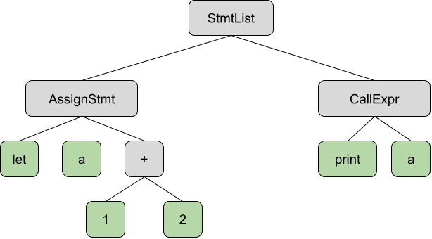

# LispJS

LispJS is a JavaScript interpreter written entirely in Common Lisp, that includes both a CLI and file functionality.

## How to Run

This project is formulated as an ASDF-based system (i.e. package) for Common Lisp. In order to run it, you must have SBCL and Quicklisp installed. If so, you can clone this repository into

```
~/.quicklisp/local-projects
```
or any other location that stores Quicklisp systems.

If you want to use any function available in the package, you can manually load the system in SBCL like so:

```
* (ql:quickload :lisp-js)
* (in-package :lisp-js)
```

If you don't include the last line, you can use any of the exported functions (found in package.lisp) in SBCL like so:
```
(lisp-js:<function> <args>)
```

To use the program outside of SBCL, you must compile it into a binary, which can be done using the included makefile with
```
make build
```

The compiled binary can be ran like so:
```
./lispjs [file-name]
```

## How Does LispJS Work?

LispJS was built entirely from scratch (by me!), and follows a typical interpreter software pipeline.

### Lexer

The lexer generates a list of tokens from the input file or string. The lexer generates tokens by relating regular expressions to token types, and capturing the longest match at the beginning of the input string. If a match is found, a token is generated and associated with the string that matched it, and if a match is not found, the program throws a lexing error and exits. Finally, if a specific token type, like NUMBER or BOOLEAN, needs to be associated with a non-string, the lexer converts the associated string into the correct data type.

Related Files:
<ul>
    <li>tokenizer.lisp</li>
    <li>js-convert.lisp</li>
</ul>

Example:

The lexer converts this input:
```
let a = 1 + 2;
print(a)
```

into this sequence of tokens:
```
(LET "let") (IDENTIFIER "a") (ASSIGN "=") (NUMBER 1) (PLUS "+") (NUMBER 2) (SEMICOLON ";") (PRINT "print") (LPAREN "(") (IDENTIFIER "a") (RPAREN ")")
```

### Parser

The parser follows up the lexer by structuring a given sequence of tokens into a tree structure which represents an order of operations that is meaningful to the program. The specific type of parser I implemented is a Pratt Parser, which I chose because Pratt Parsers are very easy to hack and add on to, unlike other popular parsing methods like LALR which need a formal grammar. Furthermore, Pratt Parsers are top-down but can parse matching parenthesis and left-recursion unlike the more popular ll(n) parsing method, which I find super interesting! In short, Pratt Parsers associate a binding power with operators, and group operators with higher binding powers closer to each other. My particular parser implementation uses parselets, which are functions that tell the parser how to parse tokens it encounters. Pratt Parsers were designed with basic arithmetic expressions in mind, so I had to do quite a bit of syntax directed translation (SDT) to make a clean abstract syntax tree (AST) out of JavaScript code.

Related Files:
<ul>
    <li>pratt-parser.lisp</li>
    <li>pratt-parselets.lisp</li>
</ul>

Example:

The parser would turn the sequence of tokens given in the previous example into the following AST:



### Evaluator

The evaluator is the final step in the software chain, and it evaluates boils an AST from the parser down into a singular value using big-step semantics. Big-step semantics are much slower than small-step semantics (in some cases), however they are much more intuitive and easier to understand, which is why I chose to write the evaluator using big-step semantics. 

To handle variables, the evaluator manages two environments: the call stack and the heap. The call stack stores all named variables, and each stack frame is considered its own scope. When a variable is referenced in code, the call stack is searched from the top down and the first variable binding found is returned. Stack frames are added when a scope is entered, and removed when a scope is exited. Constant variables are stored directly on the stack because variables stored on the stack are not allowed to be modified or redifined (in the current scope). The heap is used to store mutable variables and non-primitve objects, and works by mapping reference numbers (like pointers) to values, and allowing any pointed-to value to be updated. The stack and the heap work together to create mutable variables by storing the variable's value on the heap, and the pointer to the value on the stack.

Related Files:

<ul>
    <li>eval.lisp</li>
    <li>js-convert.lisp</li>
    <li>js-op.lisp</li>
    <li>js-env.lisp</li>
</ul>

Example:

After evaluating the AST given by the previous example, the environments and program output would look like this:

Stack:
```
(
    ;; First frame
    (
        (a . (RefVal 1))
    )
)
```

Heap:
```
(
    (1 . 3)
)
```

Console Output:
```
3
```

Returned Value:
```
undefined
```

### Command Line Interface

The command line interface is how you may most commonly interact with LispJS. The CLI is very simple, and just waits until you type something, then feeds the string you input into the rest of the toolchain, updates the environment, and finally pretty prints the returned value.

Related Files:

<ul>
    <li>lisp-js.lisp</li>
</ul>

## What JS Functionality Does LispJS Include?

### Primitive Data Types

<ul>
    <li>Number</li>
    <li>Boolean</li>
    <li>String</li>
    <li>Undefined</li>
    <li>Null</li>
</ul>

### Infix Operators

<ul>
    <li>Arithmetic: + - * / ** %</li>
    <li>Inequality: > >= < <= </li>
    <li>Equality: == === != !==</li>
    <li>Logical: && ||</li>
    <li>Bitwise: & | ^</li>
    <li>Shifting: << >></li>
    <li>Object-Specific: in</li>
</ul>

### Prefix Operators

<ul>
    <li>Arithmetic: + -</li>
    <li>Logical: !</li>
    <li>Bitwise: ~</li>
    <li>Miscellaneous: typeof</li>
</ul>

### Assignment

<ul>
    <li>const ... = ...</li>
    <li>let ... = ...</li>
    <li>let ...</li>
    <li>... = ...</li>
</ul>

### Operation-Assignment

<ul>
    <li>Arithmetic: += -= *= /= **= %=</li>
    <li>Logical: &&= ||=</li>
    <li>Bitwise: &= |= ^=</li>
    <li>Shifting: <<= >>=</li>
</ul>

### Loops

<ul>
    <li>for(...;...;...){...}</li>
    <li>for(var in object){...}</li>
    <li>while(...){...}</li>
</ul>

### Conditionals
<ul>
    <li>if(...){...} else if(...){...} else{...}</li>
</ul>

### Blocks

<ul>
    <li>{...}</li>
</ul>

### Functions

<ul>
    <li>Named: function f(...){...}</li>
    <li>Anonymous: function(...){...}</li>
    <li>Arrow: (...) => ...</li>
    <li>Lexical Scope</li>
    <li>'return' keyword</li>
</ul>

### Objects

<ul>
    <li>Syntax: {name:value, name:value, ...}</li>
    <li>Dot Access: object.key</li>
    <li>Index Access: object[key]</li>
    <li>'this' keyword</li>
</ul>

### Lists
<ul>
    <li>Syntax: [value, value, value, ...]</li>
    <li>Lists are objects under the hood</li>
    <li>Special pretty-print rules</li>
</ul>

### Primitive Functions
<ul>
    <li>Number(...)</li>
    <li>String(...)</li>
    <li>Boolean(...)</li>
    <li>print(value, value, ...)</li>
    <li>input(&optional prompt)</li>
    <li>random(&optional max-number)</li>
    <li>size(object)</li>
    <li>keys(object)</li>
    <li>exit(&optional status-code)</li>
</ul>

## Development Information

This project was developed and tested on Ubuntu 20.04.6 LTS and MacOS Sonoma.

## Credits

Quicklisp Packages:
- Alexandria
- CL-PPCRE
- parse-number

Pratt Parsers:
- https://matklad.github.io/2020/04/13/simple-but-powerful-pratt-parsing.html
- https://www.youtube.com/watch?v=qyZQPJYvsGw